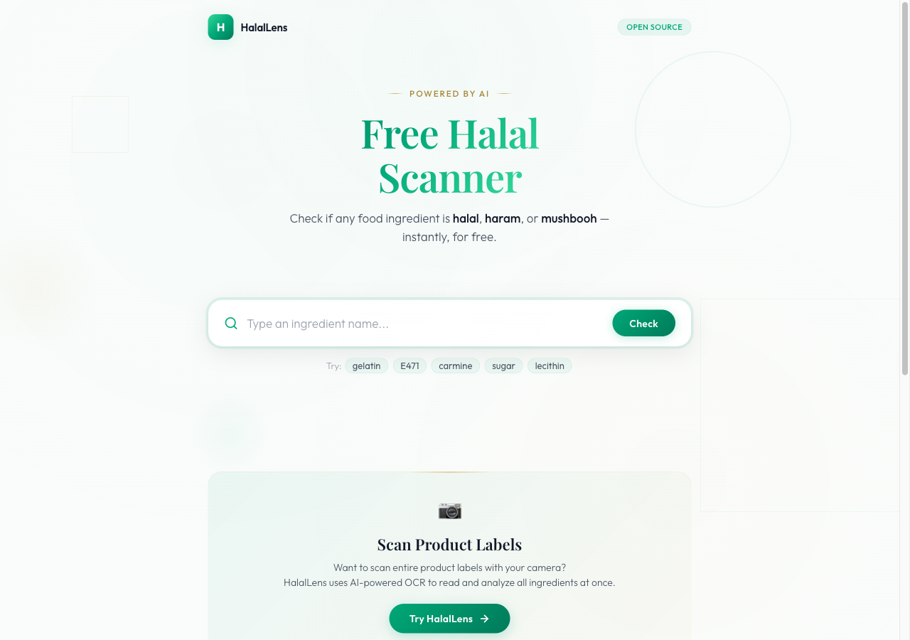
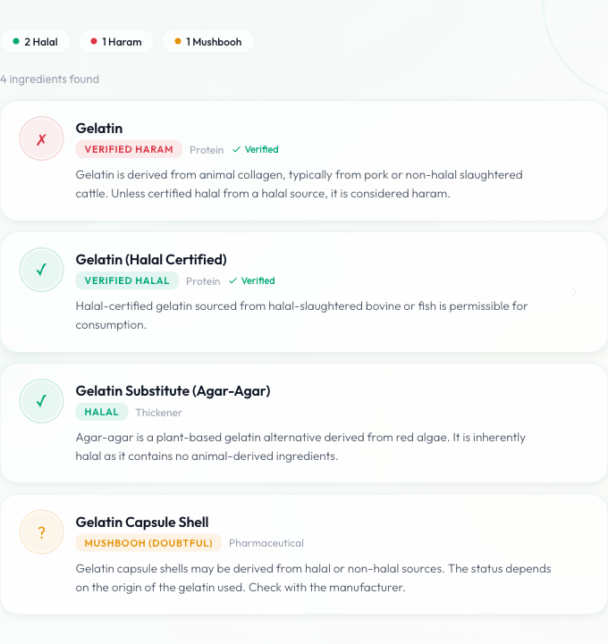

<div align="center">
  

  # Free Halal Scanner

  **Check if any food ingredient is halal, haram, or mushbooh — instantly.**

  [](https://www.npmjs.com/package/@halallens/halal-scanner)
  [](LICENSE)
  [](https://www.typescriptlang.org/)

  [Live Demo](https://halallens-no.github.io/halal-scanner/) · [npm Package](https://www.npmjs.com/package/@halallens/halal-scanner) · [Full Web App](https://app.halallens.no)
</div>

---

## What is this?

A free, open-source npm package and demo UI for checking the halal status of food ingredients. Powered by the [HalalLens](https://halallens.no) API — a database of 10,000+ ingredients analyzed by AI and verified by the community.

### Features

- **Instant search** — Type any ingredient name or E-number
- **Halal status** — HALAL, HARAM, MUSHBOOH, or UNKNOWN with confidence scores
- **AI explanations** — Understand *why* an ingredient has its status
- **TypeScript support** — Full type definitions included
- **Zero dependencies** — Uses native `fetch`, works in Node.js 18+ and all modern browsers
- **Free forever** — No API key required

## Try it

**[Live Demo →](https://halallens-no.github.io/halal-scanner/)**



## Install

```bash
npm install @halallens/halal-scanner
```

## Usage

```typescript
import { HalalScanner } from '@halallens/halal-scanner';

const scanner = new HalalScanner();

// Search for ingredients
const results = await scanner.search('gelatin');
console.log(results.items[0].halal_status); // "HARAM"
console.log(results.items[0].display_status); // "Verified HARAM"

// Get detailed ingredient info
const detail = await scanner.check('en', 'gelatin');
console.log(detail.explanation);
console.log(detail.food_source); // "Animal"

// Batch analyze multiple ingredients
const analysis = await scanner.analyze(['gelatin', 'sugar', 'E471']);
console.log(`${analysis.halal_count} halal, ${analysis.haram_count} haram`);
```

## API

### `new HalalScanner(options?)`

| Option | Type | Default | Description |
|--------|------|---------|-------------|
| `baseUrl` | `string` | `https://halallens.no/api` | API base URL |
| `deviceId` | `string` | Auto-generated | Device ID for usage tracking |
| `timeout` | `number` | `10000` | Request timeout in ms |

### `scanner.search(query, params?)`

Search for ingredients by name or E-number.

```typescript
const results = await scanner.search('E471', { perPage: 5 });
```

### `scanner.check(lang, name)`

Get detailed info about a specific ingredient.

```typescript
const info = await scanner.check('en', 'sugar');
```

### `scanner.analyze(ingredients)`

Analyze multiple ingredients at once.

```typescript
const result = await scanner.analyze(['sugar', 'gelatin', 'citric acid']);
```

## Status Values

| Status | Meaning |
|--------|---------|
| `HALAL` | Permissible to consume |
| `HARAM` | Not permissible to consume |
| `MUSHBOOH` | Doubtful — depends on source or processing |
| `UNKNOWN` | Not yet analyzed |

## Want more?

This package provides ingredient lookup. For the **full experience**:

- **Scan product labels** with your camera (OCR-powered)
- **AI-powered analysis** of entire ingredient lists
- **Multi-language support** in 14+ languages
- **Mobile apps** for Android and iOS

**[Try HalalLens →](https://app.halallens.no)**

## Contributing

Contributions welcome! Please read [CONTRIBUTING.md](CONTRIBUTING.md) before submitting a PR.

## License

[MIT](LICENSE) — Free to use with attribution to [HalalLens](https://halallens.no).

---

<div align="center">
  <sub>Built with care by <a href="https://halallens.no">HalalLens</a> — AI-powered halal food verification</sub>
</div>
